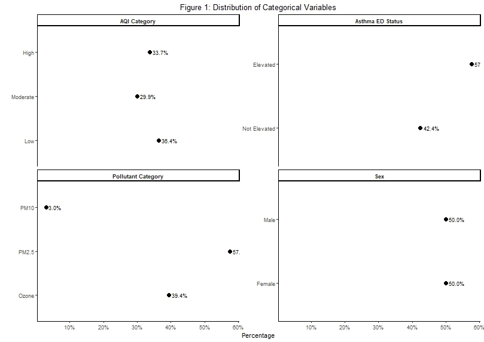
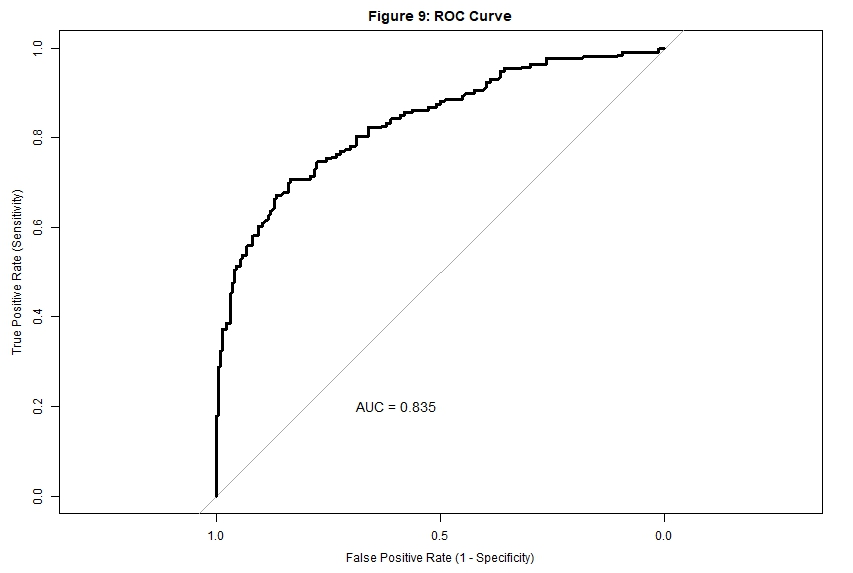
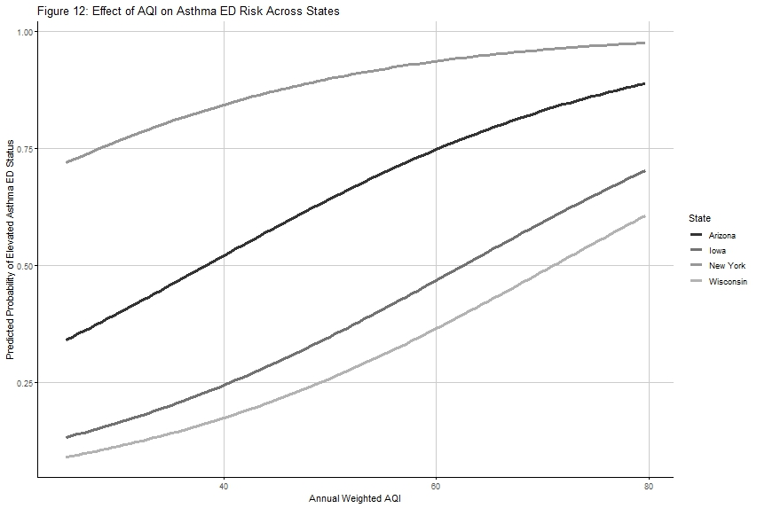

# Air Pollution and Asthma Burden in the United States

## Overview

This project examines the association between county-level air pollution exposure and elevated asthma-related emergency department (ED) visit rates in the United States using 2023 public health and environmental data.

Air quality data were integrated with county-level asthma ED data to evaluate air pollution exposure using continuous and categorical measures. The analysis included descriptive statistics, bivariate and stratified analyses, logistic regression, model comparison and selection, model diagnostics, sensitivity analysis, ROC/AUC assessment, and adjusted predicted probabilities.

This project was completed as part of graduate coursework in Categorical Data Analysis at UTHealth Houston and was subsequently organized as a reproducible research portfolio project.

---

## Research Question

**Is air pollution exposure, measured using both continuous annual weighted AQI and categorical AQI indicators, associated with elevated asthma-related emergency department visit rates across U.S. counties after accounting for state-level variation?**

---

## Study Design

This project used a **cross-sectional ecological study design**.

The unit of analysis was the county-level observation. Air quality and asthma emergency department data were linked using state, county, and year.

The analysis evaluates population-level associations and does not support individual-level causal inference.

---

## Data Sources

### Air Quality Data

**Source:** U.S. Environmental Protection Agency (EPA)

County-level annual Air Quality Index (AQI) data for 2023 were used to characterize air pollution exposure.

### Asthma Emergency Department Data

**Source:** Centers for Disease Control and Prevention (CDC)

County-level age-adjusted asthma emergency department visit rates per 10,000 population were used to characterize asthma-related healthcare utilization.

For additional information about the datasets and variable construction, see the [Data Documentation](data/README.md).

---

## Analytical Dataset

The EPA air quality and CDC asthma datasets were processed separately and merged using:

- State
- County
- Year

The resulting analytical dataset contains the environmental exposure measures, asthma outcome measures, geographic identifiers, and derived variables used throughout the statistical analysis.

The complete variable definitions are available in the [Variable Codebook](docs/variable_codebook.md).

---

## Variables

| Variable | Analytical Role |
|---|---|
| `Asthma_ED_Status` | Primary outcome |
| `Annual_Weighted_AQI` | Primary continuous exposure |
| `AQI_Category` | Primary categorical exposure |
| `prop_unhealthy` | Supporting continuous exposure |
| `Pollutant_Category` | Exploratory exposure |
| `State` | Geographic adjustment variable |
| `County` | Geographic identifier |
| `Sex` | Used in construction of the primary outcome |

### Primary Outcome

`Asthma_ED_Status` indicates whether the age-adjusted asthma ED visit rate exceeded a sex-specific benchmark.

- **Male:** Elevated if asthma ED rate > 27.1 per 10,000
- **Female:** Elevated if asthma ED rate > 32.3 per 10,000

### Primary Exposure

`Annual_Weighted_AQI` is a continuous annual air-quality measure constructed by weighting the number of days in each AQI category using representative AQI values.

`AQI_Category` represents Low, Moderate, and High exposure based on the distribution of the proportion of unhealthy AQI days.

For detailed variable definitions and construction, see the [Variable Codebook](docs/variable_codebook.md).

---

## Analysis Workflow

```text
EPA AQI Data
     │
     ├── Annual Weighted AQI
     ├── Proportion Unhealthy Days
     ├── AQI Category
     └── Pollutant Category
     │
     ▼
Merge by State + County + Year
     ▲
     │
CDC Asthma ED Data
     │
     └── Elevated Asthma ED Status
     │
     ▼
Descriptive Analysis
     │
     ▼
Bivariate & Stratified Analysis
     │
     ▼
Logistic Regression
     │
     ▼
Model Comparison & Selection
     │
     ▼
Model Diagnostics
     │
     ▼
Sensitivity Analysis
     │
     ▼
Predicted Risk Visualization
```

---

## Statistical Methods

The analytical workflow included:

- Descriptive statistics for categorical and continuous variables
- Contingency-table analysis
- Pearson chi-square tests
- Likelihood-ratio tests
- Cochran–Armitage trend tests
- Odds ratios and relative risks
- Cochran–Mantel–Haenszel stratified analysis
- Simple logistic regression
- Multiple logistic regression
- AIC-based model comparison
- Likelihood-ratio model comparison
- Interaction assessment
- Forward, backward, and stepwise variable selection
- Variance inflation factor assessment
- Pearson and deviance residual diagnostics
- Cook's distance
- Pearson goodness-of-fit assessment
- Hosmer–Lemeshow goodness-of-fit testing
- ROC curve and AUC analysis
- Sensitivity analysis after removal of influential observations
- Adjusted predicted probability visualization

---

## Key Findings

### 1. Unadjusted Association

AQI category demonstrated a statistically significant unadjusted association with elevated asthma ED status:

- **χ² = 22.61**
- **p < 0.001**

However, the observed direction of the association was counterintuitive.

### 2. Geographic Confounding

After accounting for state-level variation using stratified analysis, the categorical AQI association was no longer statistically significant:

- **CMH p = 0.398**

This indicated substantial geographic confounding of the unadjusted association.

### 3. Final Model

The final selected logistic regression model included:

`Annual_Weighted_AQI + State`

Model comparison favored this specification over models incorporating pollutant category or categorized AQI.

### 4. Sensitivity Analysis

After influential observations were excluded, the estimated AQI association became stronger and model discrimination improved.

ROC AUC increased approximately from:

- **Primary model: 0.835**
- **Sensitivity-analysis model: 0.879**

---

## Key Visualizations

### Categorical Variable Distributions



[View full-size figure](figures/categorical_variable_distributions.jpeg)

### ROC Curve — Final Model



[View full-size figure](figures/roc_final_model.jpeg)

### Predicted Asthma Risk Across States



[View full-size figure](figures/predicted_asthma_risk_by_state.jpeg)

Additional visualizations are available in the [`figures/` directory](figures/).

---

## Repository Structure

```text
air-pollution-asthma-analysis/
│
├── README.md
├── .gitignore
│
├── code/
│   ├── 01_prepare_aqi_data.R
│   ├── 02_prepare_asthma_data.R
│   ├── 03_merge_datasets.R
│   ├── 04_descriptive_analysis.R
│   ├── 05_bivariate_analysis.R
│   ├── 06_stratified_analysis.R
│   ├── 07_logistic_regression.R
│   ├── 08_model_selection.R
│   ├── 09_model_diagnostics.R
│   ├── 10_sensitivity_analysis.R
│   └── 11_predictions_visualization.R
│
├── data/
│   ├── README.md
│   ├── raw/
│   └── processed/
│
├── docs/
│   ├── variable_codebook.md
│   ├── project_report.pdf
│   └── project_presentation.pdf
│
├── figures/
│   ├── README.md
│   ├── aqi_asthma_mosaic.jpeg
│   ├── categorical_variable_distributions.jpeg
│   ├── continuous_variable_boxplots.jpeg
│   ├── cooks_distance.jpeg
│   ├── deviance_residuals.jpeg
│   ├── influential_observations.jpeg
│   ├── pearson_residuals.jpeg
│   ├── pollutant_asthma_mosaic.jpeg
│   ├── predicted_asthma_risk_by_state.jpeg
│   ├── residuals_vs_fitted.jpeg
│   ├── roc_final_model.jpeg
│   └── roc_sensitivity_model.jpeg
│
└── results/
    └── tables/
```

### Quick Navigation

- [R Analysis Scripts](code/)
- [Data and Data Documentation](data/)
- [Variable Codebook](docs/variable_codebook.md)
- [Final Project Report](docs/project_report.pdf)
- [Project Presentation](docs/project_presentation.pdf)
- [Analysis Figures](figures/)
- [Analysis Tables](results/tables/)

---

## Reproducing the Analysis

Run the R scripts in the following order:

1. [`01_prepare_aqi_data.R`](code/01_prepare_aqi_data.R)
2. [`02_prepare_asthma_data.R`](code/02_prepare_asthma_data.R)
3. [`03_merge_datasets.R`](code/03_merge_datasets.R)
4. [`04_descriptive_analysis.R`](code/04_descriptive_analysis.R)
5. [`05_bivariate_analysis.R`](code/05_bivariate_analysis.R)
6. [`06_stratified_analysis.R`](code/06_stratified_analysis.R)
7. [`07_logistic_regression.R`](code/07_logistic_regression.R)
8. [`08_model_selection.R`](code/08_model_selection.R)
9. [`09_model_diagnostics.R`](code/09_model_diagnostics.R)
10. [`10_sensitivity_analysis.R`](code/10_sensitivity_analysis.R)
11. [`11_predictions_visualization.R`](code/11_predictions_visualization.R)

The first three scripts prepare and merge the source datasets. The remaining scripts reproduce the descriptive analyses, statistical modeling, model evaluation, sensitivity analysis, and predicted-risk visualization.

---

## Software and Packages

The analysis was conducted in **R**.

### R Packages

- `readr`
- `readxl`
- `dplyr`
- `tidyr`
- `ggplot2`
- `gtsummary`
- `gt`
- `vcd`
- `DescTools`
- `broom`
- `MASS`
- `ResourceSelection`
- `pROC`
- `car`
- `writexl`
- `stringr`
- `scales`

---

## Project Documentation

| Resource | Description |
|---|---|
| [Variable Codebook](docs/variable_codebook.md) | Definitions, coding, and analytical roles of project variables |
| [Final Project Report](docs/project_report.pdf) | Full written report describing the study and statistical analysis |
| [Project Presentation](docs/project_presentation.pdf) | Presentation summarizing the project and findings |
| [Data Documentation](data/README.md) | Description of the EPA, CDC, and analytical datasets |
| [Analysis Figures](figures/) | Visualizations generated during the analysis |
| [Analysis Tables](results/tables/) | Statistical tables and model outputs |
| [R Scripts](code/) | Complete R analytical workflow |

---

## Limitations

Several limitations should be considered when interpreting the findings:

- The cross-sectional ecological design does not permit individual-level causal inference.
- Counties within the same state may not represent statistically independent observations.
- Spatial dependence between geographically neighboring counties may be present.
- Socioeconomic, demographic, healthcare-access, and other potentially important confounding variables were not included in the primary models.
- Merging the datasets required matching geographic and temporal information and may have excluded unmatched observations.
- County-level associations should not be interpreted as individual-level relationships.

---

## Potential Extensions

Future analyses could extend this work through:

- multilevel logistic regression with counties nested within states;
- spatial regression to account for geographic dependence;
- incorporation of socioeconomic and healthcare-access covariates;
- pollutant-specific exposure modeling;
- multi-year longitudinal analysis;
- alternative definitions of elevated asthma burden.

---

## Author

**Parminder S. Kooner**

M.S. Biostatistics & Data Science  
UTHealth Houston School of Public Health

[GitHub Profile](https://github.com/pskooner)

---

## Repository Navigation

**[Code](code/)** · **[Data](data/)** · **[Codebook](docs/variable_codebook.md)** · **[Report](docs/project_report.pdf)** · **[Presentation](docs/project_presentation.pdf)** · **[Figures](figures/)** · **[Results](results/)** · **[Tables](results/tables/)**
